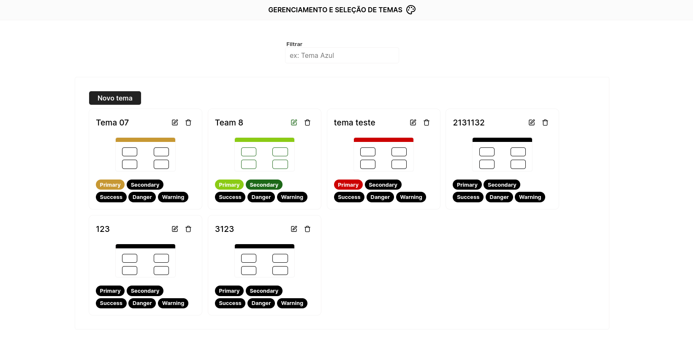

# Gerenciamento e seleção de temas (Frontend)

> Esta é uma aplicação desenvolvida para um teste técnico requisitado pela empresa <strong>Weduka</strong>.

  

    
    
  

## 📄 Casos de uso

- Visualizar a lista de temas.
- Adicionar um novo tema.
- Editar um tema existente.
- Remover um tema caso não esteja selecionado.
- Visualizar em um preview as cores selecionadas no registro e edição de temas.
- Na visualização dos temas exibir uma miniatura do tema aplicado.
- Ao selecionar um tema, deve alterar as cores do sistema para as cores do tema selecionado.

## 💡 Padrões abordados

- Como boas práticas e para facilitar a testabilidade do projeto foi utilizado injeção e inversão de dependência.

## 🚀 Melhorias futuras

- [ ] Criar uma documentação para tipagem da aplicação utilizando JSDoc.
- [ ] Criar mais testes automatizados para testar as rotas da aplicação.
- [ ] Implementar testes e2e para testar o fluxo completo das operações.

## 💻 Como rodar o projeto

- O projeto foi desenvolvido com HTML, CSS e JavaScript, sendo assim pode ser executado sem um servidor apenas abrindo
o arquivo `index.html` que se encontra em `src/pages/index.html`. Porém como o projeto está utilizando um api, é
importante que execute em um servidor. É recomendado o uso da extensão `Live Server` para o vscode ou outra de sua
preferência.

#### Pré-requisitos

- Para ter informações disponíveis no frontend você deve clonar o repositório da api que se encontra em
https://github.com/IgorAlvesR/theme-management-api. Nesse repo
tem todas informações necessárias para rodar a api.

#### Executando o projeto

- Com a api no ar, podemos executar nosso projeto abrindo o arquivo `index.html` em `sr/pages/index.html` com a extensão
`Live Server`. Para abrir basta clicar com o botão direito em cima do arquivo e `open with Live Server`. O projeto
estará acessível em http://127.0.0.1:5500/src/pages/index.html.

#### Executando os testes automatizados

- Para executar os testes automatizados é necessário que tenha o node `v18 ou maior` instalado na máquina.
- Com o node instalado, na raiz do projeto rode o comando `npm install` para instalar as dependências.
- Com as dependências instaladas podemos rodar os testes com o comando `npm test`.

## 🌐 Links úteis
[HTML](https://developer.mozilla.org/pt-BR/docs/Web/HTML)
[CSS](https://developer.mozilla.org/pt-BR/docs/Web/css)
[JavaScript](https://developer.mozilla.org/pt-BR/docs/Web/javascript)
[Lucide Icons](https://lucide.dev/)
[TestingLibrary](https://testing-library.com/)

## 👨‍💻 Tecnologias utilizadas

- HTML
- CSS
- JavaScript
- Lucide (icons)

## 🧑‍💻 Igor Alves Rodrigues

